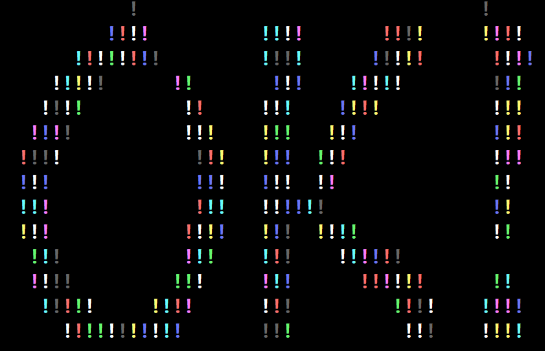
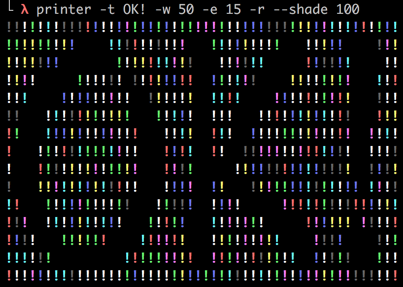
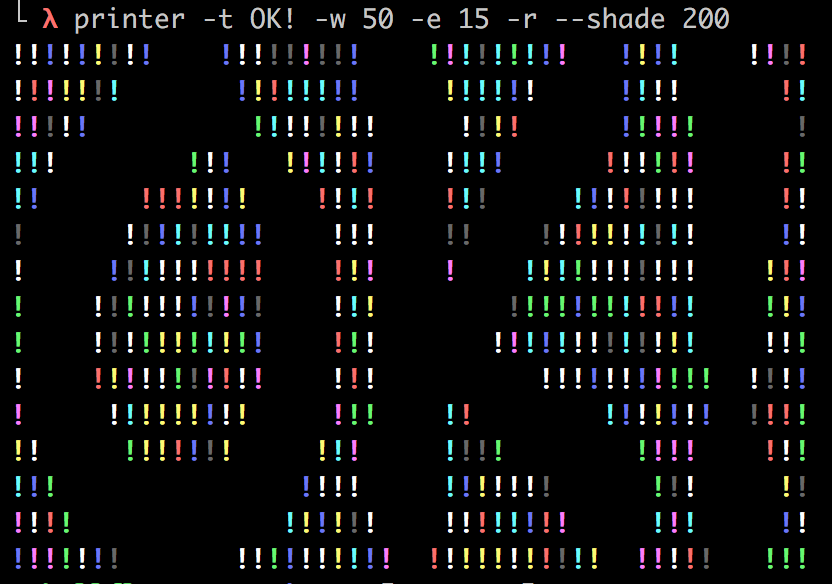
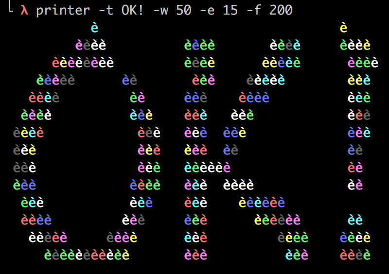

# printer

[EN Doc](docs/en.md)

golang版 终端打印机 

python版 终端打印机 [https://github.com/hellflame/terminal_printer](https://github.com/hellflame/terminal_printer)

### 效果展示

- 默认输出(第一次运行需要下载字体文件, 下载问题在后面说明)


- 给定输出文字(字体库支持的文字)


- 彩色图片输出


- 图片灰度图(在终端分辨率较高的情况下输出)


- 修改默认尺寸输出



- 镂空效果 (交换填充字符)


- 修改灰度边界阈值(`shade` 越大, 镂空区域判定越模糊, 图片输出有同样作用)





- 切换填充字符



### 安装

```bash
go get -u github.com/hellflame/printer
```

若安装过程出现 `golang**/x/image` 下载失败等等连接失败的话有以下两种选择

##### 使用代理

可参考 https://goproxy.io/ 

##### 下载可执行的二进制文件(若只需要玩具本身)

查看 https://github.com/hellflame/printer/releases 

根据运行操作系统选择下载可执行文件，放在当前路径或可执行路径即可

### 打包发布

在支持 `make` 的环境中，只需 `make build` 或指定对应操作系统即可

```bash
make build
```

也可以手动打包支持当前操作系统

```bash
# dynamic build
go build

# or
# static build
CGO_ENABLED=0 go build -ldflags "-s -w" 
```

则可在当前目录得到可执行文件

### 使用

```
usage: printer [-h] [-v] [-t TEXT] [-w WIDTH] [-e HEIGHT] [-f FILTER] [-c COLOR] [-g] [-s SHADE] [--font FONT] [-r] [IMG]

terminal printer, print your words & image in terminal

positional arguments:
  IMG                         image path

optional arguments:
  -h, --help                  show this help message
  -v, --version               show version info
  -w WIDTH, --width WIDTH     default console width
  -e HEIGHT, --height HEIGHT  default console height
  -f FILTER, --filter FILTER  filter ascii code, 0 ~ 223
  -c COLOR, --color COLOR     color code, 30 ~ 50
  -g, --gray                  gray mode
  -s SHADE, --shade SHADE     shade cliff
  -r, --reverse               reverse back & foreground

Text Options:
  -t TEXT, --text TEXT        render text content
  --font FONT                 font path or font index

more info please visit https://github.com/hellflame/printer
```

- `-t` 设置输出文字，默认作者名 (需要有字体，并且字体中包含文字)
- `-c` 设置颜色输出，默认 0 表示随机颜色
- `-f` 设置填充字符索引，部分索引输出为空白，默认输出 `i`
- `--font` 设置下载字体索引或给定字体路径 (图片不需要字体)
- `-g` 图片是否启用灰度模式
- `-s` 灰度滤波边界，即灰度二值化的边界值
- `-e` 设置输出高度，默认当前终端高度 (若无法获得，将使用一固定高度)
- `-w` 设置输出宽度，默认当前终端宽度 (若无法获得，将使用一固定宽度) 

部分使用示例在开头有展示

#### 代码复用

```go
import "github.com/hellflame/printer/draw"

func main(){
  img = draw.Clip(draw.Text(text, fontPath))
  result := draw.GeneratePixel(&img, filter, color, reverse?, gray?, shade)
  do_something_with(result)
}
```

### 字体下载

由于项目基于原python项目迁移，已存在字体库 https://github.com/hellflame/terminal_printer/tree/master/fonts

项目默认使用原项目字体路径，但只支持 `ttf` 字体

若自动下载字体缓慢，甚至下载失败，可选择手动下载字体文件，放在 `${HOME}/.terminal_fonts/` 即可

### License

The MIT License (MIT)

Copyright (c) 2019 hellflame

Permission is hereby granted, free of charge, to any person obtaining a copy
of this software and associated documentation files (the "Software"), to deal
in the Software without restriction, including without limitation the rights
to use, copy, modify, merge, publish, distribute, sublicense, and/or sell
copies of the Software, and to permit persons to whom the Software is
furnished to do so, subject to the following conditions:

The above copyright notice and this permission notice shall be included in all
copies or substantial portions of the Software.

THE SOFTWARE IS PROVIDED "AS IS", WITHOUT WARRANTY OF ANY KIND, EXPRESS OR
IMPLIED, INCLUDING BUT NOT LIMITED TO THE WARRANTIES OF MERCHANTABILITY,
FITNESS FOR A PARTICULAR PURPOSE AND NONINFRINGEMENT. IN NO EVENT SHALL THE
AUTHORS OR COPYRIGHT HOLDERS BE LIABLE FOR ANY CLAIM, DAMAGES OR OTHER
LIABILITY, WHETHER IN AN ACTION OF CONTRACT, TORT OR OTHERWISE, ARISING FROM,
OUT OF OR IN CONNECTION WITH THE SOFTWARE OR THE USE OR OTHER DEALINGS IN THE
SOFTWARE.
